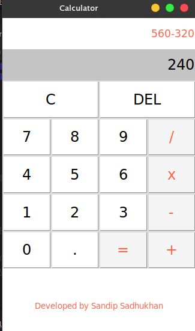

# GUI Calculator App
This is a Gui calculator tool developed by [sandip Sadhukhan](https://yourwebsite.github.io/) with **python**.

## Requirement
* python 3
## Download the Tool
go to your terminal or Command Prompt and write the following commands
```bash
git clone https://github.com/sandipsadhukhan/guicalculator.git
```
## Run the Tool
### On Mac os/Linux
```bash
cd guicalculator
python3 calculator.py
```
### On Windows
```bash
cd guicalculator
python calculator.py
```
## Screenshot


## How to Use
1. Use this for normal daily work.

## Feature
* [x] simple Gui App
* [x] Easy to Use

---
### Contact with Developer
Email : sandip.sendme@gmail.com

---
### Sponsors
<a href="https://www.youtube.com/channel/UCrgmUws8p-fPcIFZJsdenaQ"></a>